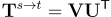

# Cross-Lingual Methods for transformation

The goal is to find a matrix **T** and then transform space **X** using the
matrix **T** as follows:


## Data 


#### Analogies data
copy into folder 
https://github.com/brychcin/cross-ling-analogies
    ```
    ./data/analogies
    ```
#### Fasttext Data 
Download Czech and English fasttext embeddings

https://fasttext.cc/docs/en/crawl-vectors.html

copy into 
```
 ./data/emb-test
 ```


## Setup

1) #### Clone github repository 
   [The repository](https://github.com/pauli31/cross-lingual-transform-method.git)
   ```
   git clone https://github.com/pauli31/cross-lingual-transform-method.git
   ```

2) #### Setup conda
    Check version
    ```
    # print version
    conda -V
   
    # print available enviroments
    conda info --envs
    ```
    Create conda enviroment
   
    ```
    # create enviroment 
    conda create --name cross-lingual-transformation-sentiment python=3.7 -y
    
    # check that it was created
    conda info --envs
   
    # activate enviroment
    conda activate cross-lingual-transformation-method
   
    # see already installed packages
    pip freeze  
    ```
   
   Install requirements
   ```
   pip install -r requirements.txt
   ```
   
3) #### Test it
    ```
   cd kiv-nlp-cross-lingual-transformations
   python3 ./src/transformations/CanonicalCorrelationAnalysis.py 
   python3 ./src/transformations/LeastSquareTransformation.py
   python3 ./src/transformations/OrthogonalRankingTransformation.py
   python3 ./src/transformations/OrthogonalTransformation.py
   python3 ./src/transformations/RankingTransformation.py
   python3 ./src/transformations/Analogies.py
   ```

4) #### Setup transformation library for usage
   Go to the library
   ```
   cd  kiv-nlp-cross-lingual-transformations
   pip install .
   # or
   pip install --upgrade .
   # or
   pip install -v --upgrade .
   ```

5) #### Import the transformation
   ```
   from transformations import CanonicalCorrelationAnalysis
   cca = CanonicalCorrelationAnalysis(method='torch')
   ```


## License
The dataset and code can be freely used for academic and research purposes. It is strictly prohibited to use the dataset for any commercial purpose.

[Creative Commons Attribution-NonCommercial-ShareAlike 4.0 International License.](https://creativecommons.org/licenses/by-nc-sa/4.0/)

Publication:
--------

If you use our dataset, software or approach for academic research, please cite the our [paper](https://arxiv.org/abs/2204.13915).

```
@InProceedings{priban-tsd-2022,
    author="P{\v{r}}ib{\'a}{\v{n}}, Pavel
    and {\v{S}}m{\'i}d, Jakub
    and Mi{\v{s}}tera, Adam
    and Kr{\'a}l, Pavel",
    editor="Sojka, Petr
    and Hor{\'a}k, Ale{\v{s}}
    and Kope{\v{c}}ek, Ivan
    and Pala, Karel",
    title="Linear Transformations for Cross-lingual Sentiment Analysis",
    booktitle="Text, Speech, and Dialogue",
    year="2022",
    publisher="Springer International Publishing",
    address="Cham",
    pages="125--137",
    isbn="978-3-031-16270-1"
}
```


Contributors:
--------

Pavel Přibáň,
Jakub Šmíd,
Adam Mištera

Contact:
--------
pribanp@kiv.zcu.cz

[http://nlp.kiv.zcu.cz](http://nlp.kiv.zcu.cz)

<!--\renewcommand{\vec}[1]{\ensuremath{\mathbf{#1}}}-->
<!--\hat{\vec{X}} = \vec{X} \vec{T} -->

## Ranking Transformation (SGD) And Hinge loss

https://www.aclweb.org/anthology/P15-1027/

http://cs231n.stanford.edu/slides/2017/cs231n_2017_lecture3.pdf

https://stats.stackexchange.com/questions/155088/gradient-for-hinge-loss-multiclass
https://cs231n.github.io/optimization-1/


https://towardsdatascience.com/solving-svm-stochastic-gradient-descent-and-hinge-loss-8e8b4dd91f5b

https://towardsdatascience.com/svm-implementation-from-scratch-python-2db2fc52e5c2

## Cannonical correlation analysis
Generally, the CCA transformation transforms both spaces **X** and **Y** into
third space **o**, see
[Linear Transformations for Cross-lingual Semantic Textual Similarity](https://arxiv.org/abs/1807.04172), [Cross-lingual Word Analogies using Linear Transformations between Semantic Spaces](https://arxiv.org/abs/1807.04175) for more details.

It computes two transformation matrices  for source space, and  for the target space.
They are computed by miniminizing the following:


We can convert the source space into target space (so we will not explicitly use the third space) as follows:


The matrices  and  can be computed using SVD  as follows:

<!--    \renewcommand{\vec}[1]{\mathbf{#1}}-->
<!--\vec{X}^{s} = \vec{U}_x \vec{\Sigma}_x \vec{V}^{\mathsf{T}}_x-->

1) Use SVD for both matrices **X** source and **Y** target as follows:


2) Compute the third space **O** and SVD


then use SVD on **O**


3) compute transformation matrices  and 


4) finally compute


Sources:

http://numerical.recipes/whp/notes/CanonCorrBySVD.pdf

https://en.wikipedia.org/wiki/Singular_value_decomposition

## Orthogonal Transformation
Orthogonal transformation preserves angles between the words (the angles are same in the original space and also in the transformed space), so it preserves cosine similarity.

Orthogonal transformation is Least square transformation with a constraint  
 that the transformation matrix **T**
is orthogonal.

The analytical solution for the optimal matrix **T** is as follows:



where matrices **V** and **U** are computed by *Singular Value Decomposition* (SVD)


<!--\renewcommand{\vec}[1]{\ensuremath{\mathbf{#1}}}-->
<!--\vec{Y}^{\mathsf{T}}\vec{X} = \vec{U}\vec{\Sigma} \vec{V}-->


#### Sources
Original Artetxe 2016 - Citation is in the two following papers

[Linear Transformations for Cross-lingual Semantic Textual Similarity](https://arxiv.org/abs/1807.04172)

[Cross-lingual Word Analogies using Linear Transformations between Semantic Spaces](https://arxiv.org/abs/1807.04175)

## Least Square Linear Transformation (Regression)
 

- The goal is to minimize:


<!-- \renewcommand{\vec}[1]{\ensuremath{\mathbf{#1}}} -->
<!-- MSE = \left \|  \vec{W}^{s \rightarrow t}\vec{X}^{s} - \vec{X}^{t}\right \|_{F}^{2} -->

- Can be solved in two ways analytically and with gradient descent


#### Analytical solution


 <!--\renewcommand{\vec}[1]{\ensuremath{\mathbf{#1}}} -->
 <!--\vec{X}\vec{T} =  \vec{Y} \\ -->
 <!--\renewcommand{\vec}[1]{\ensuremath{\mathbf{#1}}} -->
 <!--\vec{X}^{\mathsf{T}} \vec{X}\vec{T} = \vec{X} \vec{Y} \\ -->
 <!--\renewcommand{\vec}[1]{\ensuremath{\mathbf{#1}}} -->
 <!--\vec{T} = ( \vec{X}^{\mathsf{T}} \vec{X} )^{-1} \vec{X}^{\mathsf{T}} \vec{Y}\\ -->
 <!--\renewcommand{\vec}[1]{\ensuremath{\mathbf{#1}}} -->
 <!--\text{where } ( \vec{X}^{\mathsf{T}} \vec{X} )^{-1} \vec{X}^{\mathsf{T}} \text{ is pseudo-inverse matrix} -->


derivation can be found [here](https://towardsdatascience.com/analytical-solution-of-linear-regression-a0e870b038d5)
and the computation of the pseudo-inverse matrix [here](https://towardsdatascience.com/least-squares-linear-regression-in-python-54b87fc49e77)


The analytical solution with reguralization is:


 <!--\renewcommand{\vec}[1]{\ensuremath{\mathbf{#1}}} -->
 <!--\vec{T} = ( \vec{X}^{\mathsf{T}} \vec{X} + \lambda \vec{I} )^{-1} \vec{X}^{\mathsf{T}} \vec{Y}\\ -->
<!--\renewcommand{\vec}[1]{\ensuremath{\mathbf{#1}}} -->
<!--\text{where } \lambda \text{ is the reguralization parameter and } \vec{I} \text{ is identity matrix}-->


<!--\renewcommand{\vec}[1]{\ensuremath{\mathbf{#1}}} -->
<!--(\vec{X}^{\mathsf{T}} \vec{X} + \lambda \vec{I} )^{-1}  \text{ is always Invertible}-->


[approach](https://www.youtube.com/watch?v=skOcLw_fXDs) can be found here.


#### Gradient descent
(mainly based on [this aricle](https://towardsdatascience.com/vectorization-implementation-in-machine-learning-ca652920c55d))

In this case we:


We define the hypothesis of linear regression as:
<!-- \renewcommand{\vec}[1]{\ensuremath{\mathbf{#1}}} -->
<!-- \text{here we replace } \vec{T} \text{ with } \vec{\Theta} -->


<!--  \renewcommand{\vec}[1]{\ensuremath{\mathbf{#1}}} --> 
<!--  h_{\theta}(x^{(i)}) = \theta_0 x^{(i)}_0 + \theta_1 x^{(i)}_1 + \dots + \theta_j x^{(i)}_j -->


 is ussualy bias input that is equal to 1

The cost function:


<!-- J(\theta) = \frac{1}{2m} \sum_{i=1}^{m} (h_{\theta}(x^{(i)}) - y^{(i)})^2 --> 

The derivative of cost function:


<!--  \frac{\partial J(\theta) }{\partial \theta_j} = \frac{1}{m} \sum_{i=1}^{m} (h_{\theta}(x^{(i)}) - y^{(i)}) x_j^{(i)} --> 


Then each iteration of gradient descent the algorithm updates the weights  in the
following way: 


<!-- \theta_j := \theta_j - \alpha   \frac{\partial J(\theta) }{\partial \theta_j} = \theta_j - \alpha \frac{1}{m} \sum_{i=1}^{m} (h_{\theta}(x^{(i)}) - y^{(i)}) x_j^{(i)} --> 

**Now we want to make it in a vectorized form**

The cost function can be rewritten as follows:
but only for vectors!!!!!


<!-- J(\theta) = \frac{1}{2m} (X \Theta - y)^{\mathsf{T}} (X \Theta - y) \\ --> 
<!-- \text{ is same as:} \\ --> 
<!-- J(\theta) = \frac{1}{2m} \sum_{i=1}^{m} (h_{\theta}(x^{(i)}) - y^{(i)})^2 --> 

The derivative of the cost function for each parameter:


<!--\frac{\partial J(\Theta)}{ \partial \theta_j} = \frac{1}{m} (x_j)^\mathsf{T} (X \Theta - y)-->

The derivative of the cost function for all parameters:


<!--\frac{\partial J(\Theta)}{ \partial \Theta} = \frac{1}{m} X^\mathsf{T} (X \Theta - y)-->

**Reguralized form of cost function**

The reguralization is usually not applied to the bias term, note j=1 in the reguralization term of cost function


in the vectorized form the skiping of the bias term is not shown (for the regu)


Gradients:
for bias term the gradient is different bcs regu is not used for bias term


<!--\theta_0 := \theta_0 - \alpha   \frac{\partial J(\theta) }{\partial \theta_0} = \theta_0 - \alpha \frac{1}{m} \sum_{i=1}^{m} (h_{\theta}(x^{(i)}) - y^{(i)}) x_0^{(i)} , \text{ for } j=0 \\-->
<!--\theta_j := \theta_j - \alpha   \frac{\partial J(\theta) }{\partial \theta_j} = \theta_j - \alpha [ \frac{1}{m} \sum_{i=1}^{m} (h_{\theta}(x^{(i)}) - y^{(i)}) x_j^{(i)} + \frac{\lambda}{m}\theta_j] , \text{ for } j=1,2,3,...-->


Vectorized gradients:


<!--\frac{\partial J(\Theta)}{ \partial \theta_0} = \frac{1}{m} X_{[:,0]}^\mathsf{T} (X \Theta - Y)\\-->
<!--\text{ for others:}\\-->
<!--\frac{\partial J(\Theta)}{ \partial \Theta} = \frac{1}{m}[ X_{[:,1:]}^\mathsf{T} (X \Theta - Y) + \lambda \Theta_{[1:]}]-->
<!--regu_vecto_in-->


#### Sources

https://towardsdatascience.com/coding-deep-learning-for-beginners-linear-regression-part-2-cost-function-49545303d29f


https://xavierbourretsicotte.github.io/intro_ridge.html

https://machinelearningmedium.com/2017/09/11/regularized-linear-regression/

https://xavierbourretsicotte.github.io/intro_ridge.html

https://machinelearningmedium.com/2017/08/17/gradient-descent-for-linear-regression/

https://towardsdatascience.com/simple-linear-regression-explanation-and-implementation-from-scratch-with-python-26325ca5de1a


https://ml-cheatsheet.readthedocs.io/en/latest/regularization.html

https://towardsdatascience.com/linear-regression-from-scratch-with-numpy-implementation-finally-8e617d8e274c

https://courses.cs.washington.edu/courses/cse446/20wi/Lecture8/08_Regularization.pdf

https://www.youtube.com/watch?v=skOcLw_fXDs 

[Least Square Method](https://towardsdatascience.com/least-squares-linear-regression-in-python-54b87fc49e77)

[SVD](https://towardsdatascience.com/singular-value-decomposition-example-in-python-dab2507d85a0)

[Video na least square](https://www.khanacademy.org/math/linear-algebra/alternate-bases/orthogonal-projections/v/linear-algebra-another-least-squares-example)

[Source](https://towardsdatascience.com/analytical-solution-of-linear-regression-a0e870b038d5)

[Image of Yaktocat](https://octodex.github.com/images/yaktocat.png)

[Video](https://www.youtube.com/watch?v=PjeOmOz9jSY)


https://stackoverflow.com/questions/56908913/having-trouble-implementing-a-vectorized-regularized-version-of-logistic-regre 

#### General Notes
to create latex equations as image I use [https://latex2image.joeraut.com/](https://latex2image.joeraut.com/)


<!--\renewcommand{\vec}[1]{\ensuremath{\mathbf{#1}}}-->
<!--\vec{X}^{s} \text{ Is a matrix for source space}\\-->
<!--\renewcommand{\vec}[1]{\ensuremath{\mathbf{#1}}}-->
<!--\vec{Y}^{t} \text{ Is a matrix for target space}\\-->
<!--\renewcommand{\vec}[1]{\ensuremath{\mathbf{#1}}}-->
<!--\vec{T}^{s \rightarrow t} \text{ Is a transformation matrix from the source space to the target space}\\-->


